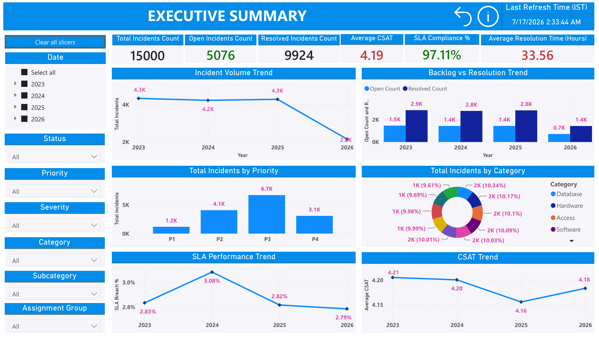
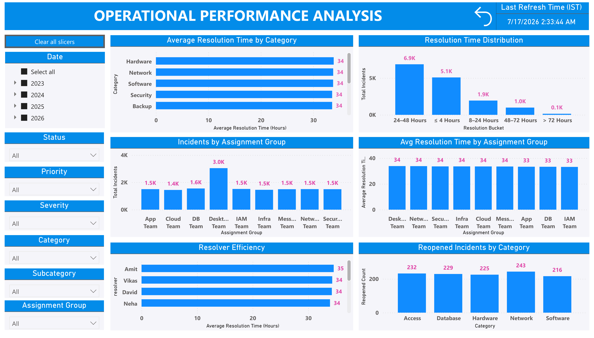
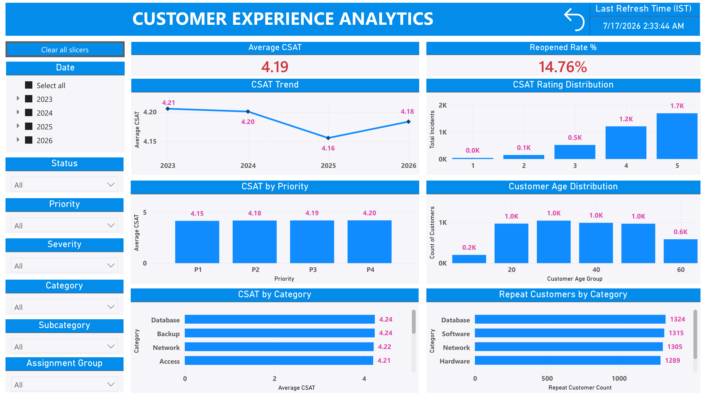
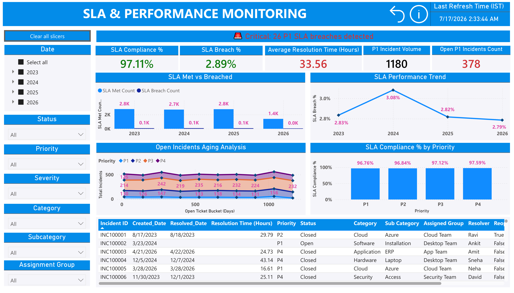
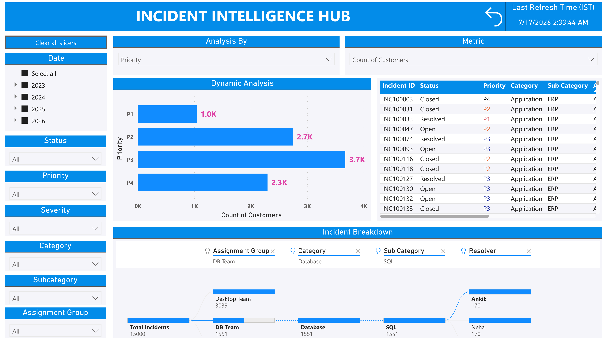
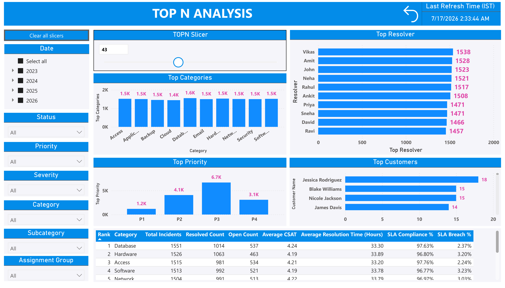
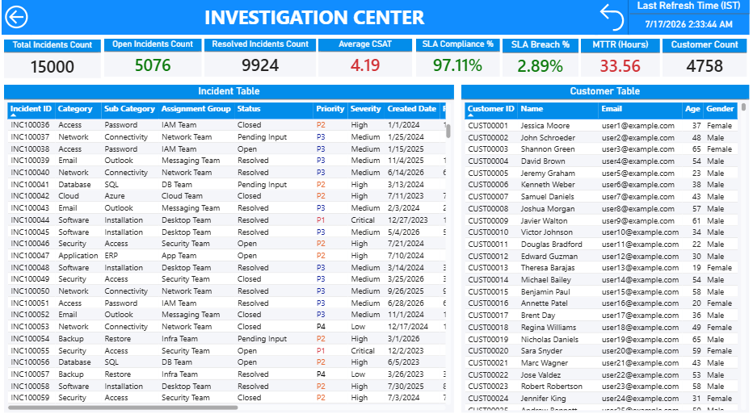
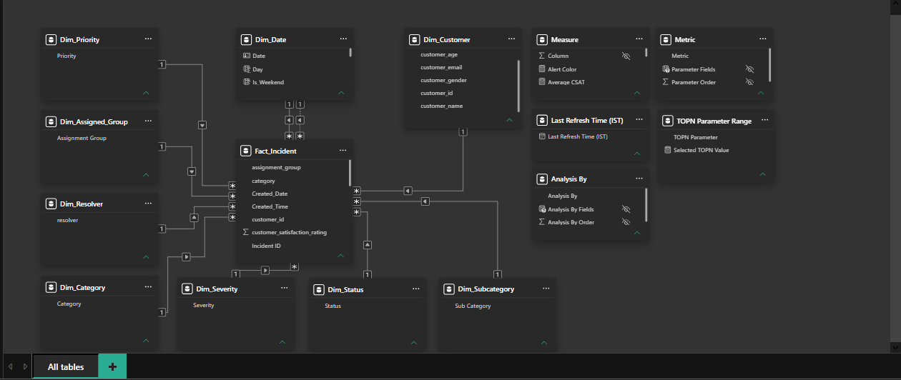

# 📊 Incident Analytics Dashboard | Power BI


An end-to-end **Power BI Incident Analytics solution** designed to analyze IT service management (ITSM) data across incident volume, SLA performance, operational efficiency, customer experience, and incident drivers.

The project combines **SQL-based data preparation, Power BI data modeling, DAX measures, field parameters, interactive analysis, decomposition analysis, and dynamic Top-N reporting** to provide actionable insights for IT operations and service management teams.

---

## 📑 Table of Contents

- [Project Overview](#-project-overview)
- [Business Problem](#-business-problem)
- [Dashboard Overview](#-dashboard-overview)
- [Key Business Insights](#-key-business-insights)
- [Dashboard Pages](#-dashboard-pages)
- [Key Features](#-key-features)
- [Tools and Technologies](#-tools-and-technologies)
- [Data Source](#-data-source)
- [Data Model](#-data-model)
- [SQL Implementation](#-sql-implementation)
- [Repository Structure](#-repository-structure)
- [How to Use](#-how-to-use)
- [Future Enhancements](#-future-enhancements)
- [Author](#-author)

---

## 🎯 Project Overview

The **Incident Analytics Dashboard** is a Power BI project that simulates a real-world IT Service Management (ITSM) analytics environment.

The dashboard analyzes **15,000 incident records from 2023 to 2026** and provides visibility into:

- Incident volume and trends
- Open and resolved incident backlog
- SLA compliance and breaches
- Resolution time
- Customer satisfaction (CSAT)
- Reopened incidents
- Assignment group performance
- Resolver performance
- Incident aging
- Customer behavior
- Dynamic incident analysis
- Root-cause-style incident decomposition
- Dynamic Top-N analysis

The objective is to enable IT operations teams and management to move from static reporting toward interactive, data-driven incident analysis.

---

## 💼 Business Problem

IT support organizations handle large volumes of incidents across multiple priorities, categories, assignment groups, and resolvers.

Without centralized analytics, stakeholders may struggle to answer questions such as:

- How effectively are incidents being resolved?
- Are SLA targets being consistently achieved?
- Which priorities or categories contribute most to SLA breaches?
- Which teams handle the highest incident volumes?
- How long are incidents remaining open?
- Which categories experience the highest reopened incidents?
- How does customer satisfaction vary by priority and category?
- What factors are driving incident volumes?
- Who are the top-performing or highest-volume resolvers?
- How can users dynamically analyze different metrics without creating separate reports?

This dashboard consolidates these analytical requirements into a multi-page Power BI solution.

---

## 📊 Dashboard Overview

The solution contains **6 interactive analytical pages**:

1. Executive Summary
2. Operational Performance Analysis
3. Customer Experience Analytics
4. SLA & Performance Monitoring
5. Incident Intelligence Hub
6. Top N Analysis
7. Investigation Center (Drillthrough)

Each page includes interactive slicers that allow analysis by:

- Date
- Status
- Priority
- Severity
- Category
- Subcategory
- Assignment Group

---

## 💡 Key Business Insights

Based on the complete dataset:

| KPI | Value |
|---|---:|
| Total Incidents | 15,000 |
| Open Incidents | 5,076 |
| Resolved Incidents | 9,924 |
| SLA Compliance | 97.11% |
| SLA Breach Rate | 2.89% |
| Average CSAT | 4.19 |
| Average Resolution Time | 33.56 Hours |
| P1 Incident Volume | 1,180 |
| Open P1 Incidents | 378 |
| P1 SLA Breaches | 26 |
| Reopened Rate | 14.76% |

### Key Observations

- **SLA performance remains strong overall**, with 97.11% compliance and a 2.89% breach rate.
- **5,076 incidents remain open**, making backlog management an important operational focus area.
- **26 P1 incidents breached SLA**, highlighting the importance of continued monitoring of business-critical incidents.
- **P3 represents the highest incident volume**, with approximately 6.7K incidents.
- **Average CSAT is 4.19**, indicating generally positive customer satisfaction.
- CSAT declined to **4.16 in 2025** before showing recovery in 2026.
- The overall **reopened incident rate is 14.76%**, providing an opportunity to investigate resolution quality and recurring issues.
- The **Desktop Team handles the largest incident workload**, with approximately 3K incidents.
- Resolution time is concentrated primarily in the **24–48 hour** bucket.

---

# 📈 Dashboard Pages

## 1️⃣ Executive Summary

Provides a high-level overview of overall incident management performance.

### Key Metrics

- Total Incidents
- Open Incidents
- Resolved Incidents
- Average CSAT
- SLA Compliance %
- Average Resolution Time

### Analysis Included

- Incident Volume Trend
- Backlog vs Resolution Trend
- Incident Distribution by Priority
- Incident Distribution by Category
- SLA Performance Trend
- CSAT Trend



---

## 2️⃣ Operational Performance Analysis

Focuses on the operational efficiency of support teams and resolvers.

### Analysis Included

- Average Resolution Time by Category
- Resolution Time Distribution
- Incidents by Assignment Group
- Average Resolution Time by Assignment Group
- Resolver Efficiency
- Reopened Incidents by Category

This page helps identify workload distribution, resolution patterns, and areas where operational efficiency can be improved.



---

## 3️⃣ Customer Experience Analytics

Provides insights into customer satisfaction and repeat incident behavior.

### Key Metrics

- Average CSAT: **4.19**
- Reopened Rate: **14.76%**

### Analysis Included

- CSAT Trend
- CSAT Rating Distribution
- CSAT by Priority
- Customer Age Distribution
- CSAT by Category
- Repeat Customers by Category

This page connects incident management performance with customer experience outcomes.



---

## 4️⃣ SLA & Performance Monitoring

Provides detailed monitoring of SLA performance and high-priority incidents.

### Key Metrics

- SLA Compliance: **97.11%**
- SLA Breach Rate: **2.89%**
- Average Resolution Time: **33.56 Hours**
- P1 Incident Volume: **1,180**
- Open P1 Incidents: **378**

### Analysis Included

- SLA Met vs Breached
- SLA Performance Trend
- Open Incident Aging Analysis
- SLA Compliance by Priority
- Incident-Level Detail Table

The dashboard also includes a dynamic alert highlighting critical P1 SLA breaches.

**Current Dataset Alert: 26 P1 SLA breaches detected.**



---

## 5️⃣ Incident Intelligence Hub

The Incident Intelligence Hub enables flexible, self-service analysis of incident data.

### Dynamic Analysis

Users can dynamically select:

- **Analysis By** dimension
- **Metric** to analyze

This allows the same visual to adapt based on the user's analytical requirements.

### Incident Breakdown

A decomposition-based analysis enables users to explore incident drivers across multiple dimensions, including:

**Total Incidents → Assignment Group → Category → Subcategory → Resolver**

This provides an interactive method for investigating the underlying factors contributing to incident volumes.



---

## 6️⃣ Top N Analysis

Provides dynamic ranking and performance analysis using a configurable Top-N parameter.

### Analysis Included

- Top Categories
- Top Resolvers
- Top Priorities
- Top Customers
- Category Performance Ranking

The detailed ranking table includes:

- Total Incidents
- Resolved Count
- Open Count
- Average CSAT
- Average Resolution Time
- SLA Compliance %
- SLA Breach %

Users can dynamically adjust the **Top-N selection** to control the number of results displayed.



---

## 7️⃣ Investigation Center — Drillthrough Page

The **Investigation Center** is a dedicated drillthrough page designed for detailed incident-level investigation.

Users can drill through from supported visuals in the main report pages to investigate the underlying records while retaining the selected filter context.

### Key KPIs

- Total Incidents
- Open Incidents
- Resolved Incidents
- Average CSAT
- SLA Compliance %
- SLA Breach %
- MTTR (Hours)
- Customer Count

### Detailed Analysis

The page provides two detailed views:

**Incident Table**
- Incident ID
- Category
- Subcategory
- Assignment Group
- Status
- Priority
- Severity
- Created Date
- Additional incident-level details

**Customer Table**
- Customer ID
- Customer Name
- Email
- Age
- Gender
- Additional customer-level details

### Drillthrough Functionality

The Investigation Center enables users to move from high-level dashboard insights to detailed underlying records.

For example, users can drill through based on dimensions such as:

- Assignment Group
- Category
- Priority
- Status
- Other supported report dimensions

The selected drillthrough context is automatically applied to the Investigation Center, allowing users to investigate the specific incidents and customers contributing to the selected metric or visual.

A **Back button** allows users to return to the originating report page after completing their investigation.



---

# ⚙️ Key Features

- Interactive multi-page Power BI dashboard
- Dynamic KPI calculations using DAX
- SQL-based data preparation
- Power Query transformations
- Interactive slicers and cross-filtering
- Dynamic Field Parameters
- Dynamic Metric Selection
- Dynamic Analysis Dimensions
- Decomposition Tree analysis
- Dynamic Top-N analysis
- SLA breach monitoring
- P1 incident alerting
- Incident aging analysis
- CSAT analysis
- Reopened incident analysis
- Resolver and assignment group performance analysis
- Detailed incident-level drill-down
- Clear-all-slicers functionality

---

# 🛠️ Tools and Technologies

| Technology | Usage |
|---|---|
| Power BI Desktop | Dashboard development and visualization |
| DAX | KPIs, measures, dynamic calculations and ranking |
| SQL | Data preparation, transformation and analysis |
| Power Query | Data cleaning and transformation |
| Microsoft Excel | Dataset distribution for project accessibility |
| GitHub | Project documentation and version control |

---

# 📂 Data Source

# 📂 Data Source

The project uses two structured datasets designed to support incident management and customer experience analytics.

### Fact Incident Dataset

The `Fact_incident_Dataset.xlsx` file contains **15,000 incident-level records** covering the period from **2023 to 2026**.

The dataset includes:

- Incident ID
- Created Date
- Resolved Date
- Priority
- Severity
- Status
- Category
- Subcategory
- Assignment Group
- Resolver
- SLA Target Hours
- Resolution Time (Hours)
- Reopened Flag
- SLA Breach Flag
- Customer ID
- Ticket Subject
- Ticket Description
- Resolution Details
- Customer Satisfaction Rating (CSAT)

### Customer Dataset

The `Dim_Customer_Dataset.xlsx` file contains **5,000 customer records** and is used as the customer dimension in the Power BI data model.

The dataset includes:

- Customer ID
- Customer Name
- Customer Email
- Customer Age
- Customer Gender

The `Customer ID` field is used to establish the relationship between the incident fact data and the customer dimension, enabling customer-level and demographic analysis.

Both datasets are provided in **Excel (.xlsx) format** within the repository for easy access and review.

SQL Server was used for data preparation and analysis before the data was modeled in Power BI. The repository also includes SQL scripts demonstrating table creation, data loading, analytical queries, KPI validation, and data quality checks.

---

# 🗃️ Data Model

The Power BI solution follows a **star-schema-style data model**, with the `Fact_Incident` table serving as the central fact table and multiple dimension tables supporting analytical filtering and segmentation.

### Core Fact Table

- `Fact_Incident` — Stores incident-level transactional data, including incident details, customer references, dates, categories, assignment groups, resolution metrics, SLA information, and customer satisfaction ratings.

### Dimension Tables

- `Dim_Date` — Supports date-based and time intelligence analysis
- `Dim_Customer` — Contains customer demographic and profile information
- `Dim_Priority` — Supports incident priority analysis
- `Dim_Severity` — Supports severity-based analysis
- `Dim_Status` — Supports incident status filtering
- `Dim_Category` — Contains incident categories
- `Dim_Subcategory` — Contains incident subcategories
- `Dim_Assigned_Group` — Supports assignment group performance analysis
- `Dim_Resolver` — Supports resolver-level performance analysis

### Supporting Tables

- `Measure` — Centralized table for DAX measures
- `Analysis By` — Field parameter used for dynamic dimension selection
- `Metric` — Field parameter used for dynamic metric selection
- `TOPN Parameter Range` — What-if parameter supporting dynamic Top-N analysis
- `Last Refresh Time (IST)` — Supports display of the latest dashboard refresh timestamp

The model uses primarily **one-to-many relationships** between dimension tables and the central fact table, enabling efficient filtering and analysis across different business dimensions.


---

# 💻 SQL Implementation

SQL was used as part of the data preparation and analytical workflow.

The SQL scripts included in the repository demonstrate operations such as:

- Table creation and data structure
- Data extraction
- Data cleaning and transformation
- JOIN operations
- Aggregations
- Incident-level analysis
- SLA analysis
- Resolution time analysis
- Category and priority analysis
- KPI validation queries

The Excel dataset included in this repository provides an accessible version of the prepared data, while the SQL scripts demonstrate the database-side data preparation and analytical approach.

---

# 📁 Repository Structure

```text
powerbi-incident-dashboard/
│
├── README.md
│
├── dataset/
├── Fact_incident_Dataset.xlsx
└── Dim_Customer_Dataset.xlsx
│
├── pbix/
│   └── Incident Analytics Dashboard.pbix
│
├── sql/
│   └── SQL scripts
│
├── docs/
│   └── Incident Analytics Dashboard.pdf
│
└── images/
    ├── executive-summary.png
    ├── operational-performance.png
    ├── customer-experience.png
    ├── sla-performance-monitoring.png
    ├── incident-intelligence-hub.png
    ├── top-n-analysis.png
    ├── investigation-center.png
    └── data-model.png
